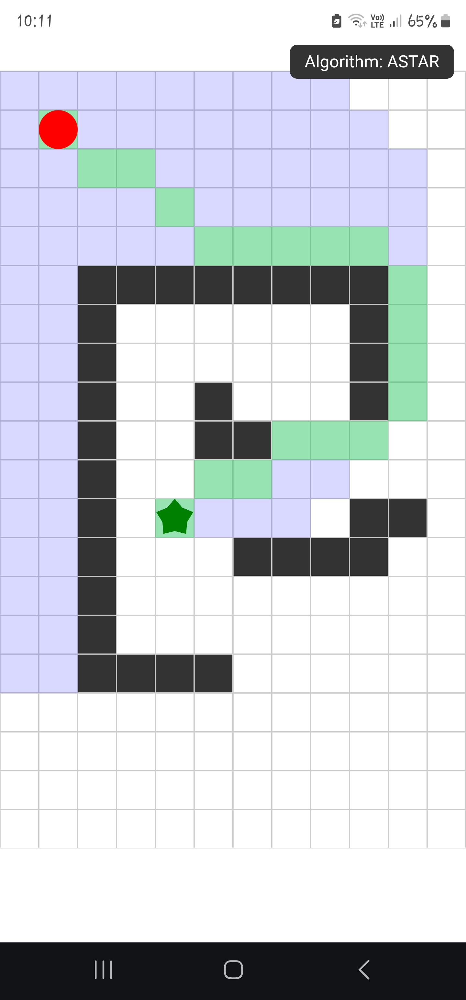

This interactive React app lets you visualize maze-solving algorithms in action.
You can toggle between A* (A-Star) and Dijkstra's algorithm to see how each pathfinding strategy navigates the maze.

Tap or click to turn a tile to a wall or vice versa.
Drag and drop the red circle (Player) or the star (Goal).

